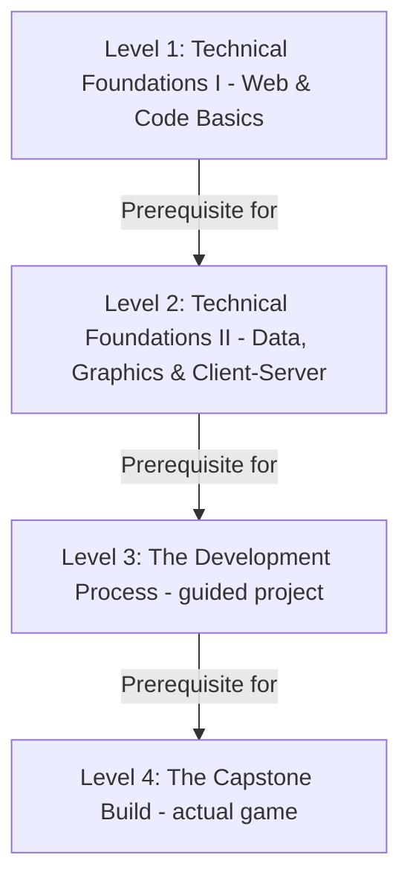

# Cyber Detective Hub - Project Definition & Educational Framework

This document outlines the core architecture, educational philosophy, and curriculum guidelines for the **Cyber Detective Hub** learning application. It serves as a source of truth for the project's evolution.

---

## 1. Educational Philosophy (AI-Era Shift)

In the era of Generative AI, memorizing programming language syntax is no longer the primary bottleneck for software engineers. Instead, the curriculum focuses on:
* **Computational Logic & Critical Thinking**: The ability to structure instructions literally, identify edge cases, and design robust algorithms.
* **System Design**: Understanding how components interact (clients, servers, databases, cloud nodes).
* **Technology Selection**: Learning how to choose and configure the right tools (databases, validation schemas, APIs, hosting pipelines).
* **Security & Defense**: Auditing system designs for security leaks, role-based privileges, and input validation gaps.

---

## 2. Level Progression & Targets

> **Restructure decision (2026-07-13):** The four levels were repositioned. **Levels 1–2 focus on technical knowledge** (concepts, exercises, and small themed labs — no cumulative game-project deliverable). **Level 3 teaches the development process** by walking one guided project through the full software lifecycle. **Level 4 is the capstone where students develop an actual, complete, deployed game.** Level 3–4 project tracks are theme-swappable in the future (e.g., a web-application track instead of a game). The platform code (`src/curriculumData.js`, `CAMPAIGN_THEMES`, project-task flows, code-review gating UI) has **not yet been updated** to this structure — docs lead, code follows.
>
> **Addendum (2026-07-18):** Levels 1 and 2's **Project Journal** homework (the session-by-session `PROJECT_TASKS` milestones a student fills in on the platform, distinct from the auto-graded Sandbox exercises) is now a **cumulative, chained build** in each level: each session's Project starts from the previous session's own saved code and extends it. In **Level 1**, this produces one assembled game by Session 12 (HTML from Session 2, CSS from Session 3, `game.js` accumulated from Sessions 4–12). In **Level 2**, `canvas.js` accumulates from Session 1 through Session 10 (Session 8 is a comprehension-only lab with no code of its own, so Session 9 chains from Session 7 instead), and the Session 11–12 SQL work chains separately (Session 12's validation rules extend Session 11's own table design); Session 13 reviews the whole accumulated build. Both levels show their assembly read-only at the final session. This does **not** change either level's Sandbox exercises, which remain standalone single-exercise drills with no carry-over, and it does **not** change Level 3's distinct role: L3 is still the only level where a student owns the **full development lifecycle** (git-diff code review, deployment, testing discipline, scope/architecture they design themselves) on a project of their own scoping. L1/L2's chaining is a lighter, fully-scaffolded mechanic on the same fixed curriculum topics every student has always had — just with real code now flowing from one session's homework into the next instead of each Project Journal entry being isolated.

The curriculum is structured step-by-step: knowledge first (L1–2), process second (L3), real product last (L4).



### Level 1: Technical Foundations I — Web & Programming Basics (Beginner)
* **Theme context**: **Racing Car Game** (2D highway racing flavor). The theme frames the Sandbox exercises and mini-labs, each of which stays a small, standalone themed artifact — no cumulative build there. The session's separate Project Journal homework, however, *is* a cumulative build across Sessions 2–12 as of the 2026-07-18 addendum above.
* **Focus**: How computers execute instructions (IPO, sequence, literalness), HTML document structure, CSS styling and positioning, JavaScript variables and math, keyboard events, conditionals and boundary logic, loops, functions and scope, timers/animation frames, 2D collision math, and DOM manipulation.
* **Target**: Master the core technical knowledge of web programming — reading, tracing, auditing, and prompting for small pieces of code with AI supervision. Students finish able to explain every construct they used; a *fully self-scoped, self-architected* game build is still deliberately deferred to Levels 3–4 — L1's Project Journal build is a fixed-topic, fully-scaffolded exercise in carrying code forward, not an open project.

### Level 2: Technical Foundations II — Data, Graphics & Client-Server (Intermediate)
* **Theme context**: **Mars Colony Defense** (space-shooter flavor). The theme frames the Sandbox exercises and mini-labs, each of which stays a small, standalone themed artifact — no cumulative build there. The session's separate Project Journal homework, however, *is* a cumulative build across Sessions 1–13 as of the 2026-07-18 addendum above (§2).
* **Focus**:
  * *Data & Graphics:* Dynamic arrays of objects, nested arrays/grid matrices, HTML5 Canvas rendering, keyboard input matrices, state machines (waves/scores/health), performance and memory awareness.
  * *Client-Server & Async:* How the web works (clients, servers, HTTP, JSON), asynchronous programming with `fetch()` and async/await, REST API concepts and calls.
  * *Database Fundamentals:* Relational tables, schemas, and basic SQL queries (taught via a browser-based SQL playground — no local database install at L2), plus data-security basics: why servers must validate input, password handling awareness, and SQL injection awareness.
* **Target**: Complete the technical-knowledge foundation: complex data structures, the async model, client-server architecture, and how persistent data is stored and protected. After Level 2 a student has *seen and understood* every layer of a full-stack app, without yet having built a real, deployed one — L2's Project Journal build (see §2 addendum) accumulates a client-side canvas.js and SQL-playground work across sessions, but doesn't connect to a real backend the student built; that's still L3–4's job.

### Level 3: The Development Process (Advanced)
* **Theme**: **Cyberpunk Hacker Arena** — the default *guided project track*. The point of Level 3 is not new syntax; it is the **process of developing software**. The track may be swapped for other product types later (e.g., a web application) without changing the process curriculum.
* **Focus**: The full development lifecycle applied to one guided game project: requirements and PRD writing, system design and architecture blueprints, Git workflow (`init`/`add`/`commit`/`push`, GitHub, Pull Requests), the 5-Step AI methodology formalized at project scale, feature-spec prompting, diff-based code review, test plans and QA, debugging and iteration cycles, backend/database integration (local MySQL via Servbay/XAMPP — applying Level 2's DB knowledge for real), and first cloud deployment.
  * *Note:* Supabase/PostgreSQL may be referenced as an alternative cloud DB option for awareness, but MySQL + Express is the primary teaching stack, matching the Cyber Detective Hub platform itself.
* **Target**: Experience how a real product gets built — from idea to deployed software — on a scoped, teacher-guided project. Students learn to run the process; the product itself is deliberately modest so process, not features, stays the focus.

### Level 4: The Capstone Build (Capstone)
* **Theme**: **The student's own complete game**, built end-to-end (default track: game; *planned alternative track:* a web application — same milestone structure, different product). Professional engineering practice is woven into the build rather than taught abstractly.
* **Focus** (milestone/sprint structure):
  * *Define:* Game concept pitch, PRD, architecture and tech-stack plan, milestone/sprint plan, repo and pipeline setup.
  * *Build:* Sprint-based feature development with the AI IDE, backend/data features (accounts, saves, leaderboard), automated testing (unit + integration), performance optimization and polish.
  * *Ship & Operate:* CI/CD pipeline (build/test/deploy on push), production monitoring and logging, beta testing/UAT, documentation, and a live launch with system defense under chaos testing.
* **Target**: Develop an **actual game** — designed, built, tested, deployed, and defended by the student — proving they can run the entire process from Level 3 independently, on top of the technical knowledge from Levels 1–2.

---

## 3. Thematic Consistency Rules

* **Single Theme per Level**: To keep students immersed and focused, all sessions within the same level must share the exact same thematic setting (e.g. all Level 1 exercises operate in the Racing Car Game setting, while Level 2 is space colony defense).
* **Theme Role Differs by Level (per the 2026-07-13 restructure)**:
  * **L1–2**: The theme is *exercise context* — it flavors sandbox exercises, mini-labs, and examples, and there is no cumulative deliverable at the Sandbox level in either. Both levels' Project Journal homework is the exception (see §2's 2026-07-18 addendum): each is a cumulative build within its own level, still on the fixed Racing Car / Mars Colony Defense themes, not a student-scoped project track like L3–4.
  * **L3–4**: The theme is a *project track* — L3's guided project (default: Cyberpunk Hacker Arena) and L4's capstone (the student's own game) are real builds. Tracks are designed to be swappable in the future (e.g., a web-application track) without changing the process curriculum.
* **Age-Appropriate Narrative**: Themes must feel adventurous, gamified, and exciting for teenagers (avoiding domestic, baby-ish concepts like baking cakes or washing dishes).
* **Interactive Sandbox Simulations**: Level 1 exercises inside the Sandbox tab must feature interactive, visual, code-involved simulators corresponding directly to that level's theme.

---

## 4. User Profiles & Authentication
* **Authentication Method**: Token-based authentication using HTTP `Authorization: Bearer <token>` headers (where the token is currently the unique identifier of the user's profile).
* **Database Schema Modifications**:
  * `user_profile`:
    * Added `username` VARCHAR(50) UNIQUE (e.g. control number or identifier)
    * Added `password` VARCHAR(100) (security access key)
    * Added `role` VARCHAR(20) DEFAULT 'student' (values: `'student'` or `'teacher'`)
* **Role-Based Control**:
  * **Teacher**: Authorized to access the Admin Panel, select campaign themes globally, register new students, and view student progress. Default account seeded: `somboon` / `somboon123`.
  * **Student**: Restricted from the Admin Panel. Progress and journal records are isolated under their own authenticated user ID. Default demo account seeded: `student_demo` / `student123`.

---

## 5. AI-Era Learning Methodology (5-Step Framework)

This framework defines the **pedagogical loop** used in every session of the Cyber Detective Hub. It replaces the traditional "watch and memorize syntax" approach with a **think, collaborate, verify, and iterate** cycle that mirrors how professional engineers work with AI tools today.

---

### Step 1 — Plan & Design the System
> **"Think before you type."**

**What students do:**
- Sketch out the problem: What inputs are needed? What should the output look like?
- Break the task into logical components (e.g., "I need a function that checks a collision, one that updates the score, and one that resets the game").
- Identify the data: What variables, arrays, or objects are needed?
- Optionally draw a simple flow diagram or pseudocode.

**Skills built:**
- Computational Logic & Algorithmic Thinking
- System Design (component decomposition)
- Requirement Clarity (defining success before building)

**Why it matters in the AI era:**
AI cannot design a system for you if *you* don't understand the problem. The quality of the plan directly determines the quality of the AI output. Weak plans produce generic, broken code.

---

### Step 2 — Write the AI Prompt
> **"Precision in language produces precision in code."**

**What students do:**
- Translate their plan from Step 1 into a clear, structured AI prompt.
- Specify: the programming language, the context (e.g., "inside an HTML5 canvas game"), the exact behavior expected, any constraints or edge cases identified in Step 1.
- Use the **Sandbox** tab in the app to write and submit their prompt.

**Skills built:**
- Prompt Engineering (the core skill of AI-era developers)
- Communication Precision (turning vague ideas into exact specifications)
- Technology Selection (deciding which tools/approaches to request)

**Why it matters in the AI era:**
Prompt writing is the new programming. A student who can write a great prompt can command any AI model, any language, and any framework — making their skills transferable beyond any single technology.

---

### Step 3 — Review & Explain the Output
> **"You own the code, even if AI wrote it."**

**What students do:**
- Read through every line of the AI-generated code.
- Explain in their own words what each function or block does.
- Identify any unfamiliar syntax or patterns and look them up.
- Accept, reject, or flag sections that seem incorrect or incomplete.

**Skills built:**
- Code Literacy (reading and understanding code without writing it from scratch)
- Critical Evaluation (distinguishing good AI output from plausible-looking bad output)
- Debugging Awareness (spotting logical issues before running the code)

**Why it matters in the AI era:**
AI output is not automatically correct. A developer who cannot read and evaluate code is at the mercy of the AI's mistakes. This step ensures students remain the **human-in-the-loop**, not passive consumers.

---

### Step 4 — Test & Break It
> **"If you haven't tried to break it, you haven't tested it."**

**What students do:**
- Run the code and verify the happy-path works as expected.
- Deliberately try to cause failures: input invalid data, trigger boundary conditions, perform unexpected actions (e.g., press multiple keys simultaneously in the racing game).
- Note what breaks and why.
- Ask: "What did the AI miss that I need to fix?"

**Skills built:**
- Debugging Mindset (systematic identification of failure modes)
- Edge-Case Thinking (anticipating the unexpected)
- Security Awareness (input validation, boundary checking)

**Why it matters in the AI era:**
This is the most critical differentiator between a passive AI user and a competent AI-era engineer. AI models optimize for the typical case; engineers must defend against the *atypical* case. Students who regularly break their own code develop a natural instinct for robustness.

---

### Step 5 — Iterate & Improve
> **"The first prompt is a draft, not a final answer."**

**What students do:**
- Based on the findings from Steps 3 and 4, refine their original prompt (or write a follow-up prompt) to fix the issues discovered.
- Re-submit to the AI, compare the new output to the previous version, and identify what improved and what regressed.
- Repeat the cycle (Steps 2–5) until the solution meets the design goals from Step 1.
- Save each revision in the **Journal** tab (tracked as `journal_versions` in the database).

**Skills built:**
- Iterative Engineering Judgment (knowing when to refine vs. restart)
- Multi-Prompt Workflow (managing a productive back-and-forth with an AI model)
- Reflective Learning (understanding *why* the revised prompt produced a better result)

**Why it matters in the AI era:**
Professional AI-era programming is a **conversation**, not a single command. The ability to iteratively refine AI output — guided by clear requirements and test results — is the workflow used by senior engineers at the world's leading technology companies. This step directly mirrors that real-world practice.

---

### Summary Table

| Step | Name | Core Question | Primary Skill |
|------|------|---------------|---------------|
| 1 | **Plan & Design** | *What do I need to build?* | Computational Logic, System Design |
| 2 | **Write the AI Prompt** | *How do I describe it precisely?* | Prompt Engineering, Communication |
| 3 | **Review & Explain** | *Do I understand what AI gave me?* | Code Literacy, Critical Evaluation |
| 4 | **Test & Break It** | *Where does it fail?* | Debugging, Edge-Case Thinking |
| 5 | **Iterate & Improve** | *How do I make it better?* | Iterative Engineering, Refinement |

---

## 6. Project Delivery Model (Decision: Option B — Hybrid)

**Decision date:** 2026-07-06 · **Scope updated:** 2026-07-13 restructure

Student-scoped, self-architected project builds exist only at **Levels 3–4** (the L3 guided project and the L4 capstone game). These follow the **Hybrid delivery model**: the platform acts as the **engineering methodology scaffold**; external AI coding tools (e.g., Cursor, ChatGPT) perform the actual code generation. Levels 1 and 2 additionally each have a lighter, fixed-topic cumulative build inside their own Project Journal (see §2's 2026-07-18 addendum) — still Hybrid-model in spirit (the platform tracks/displays the student's own code, it never executes their real game), just scoped to a single pre-set curriculum topic rather than a student-designed project.

At **Levels 1–2**, the 5-Step loop is practiced at *exercise scale* on the Sandbox — small standalone themed labs, not a growing multi-session project. Both levels' separate Project Journals are the exception (2026-07-18 addendum, §2): each runs the same 5-Step loop, but on a growing multi-session project (L1's Sessions 2–12 `game.js`; L2's Sessions 1–13 `canvas.js` + SQL) rather than a single-session lab — still a fixed, teacher-set topic, not open-ended like L3–4. The table below therefore describes the L3–4 project workflow; L1–2's Sandbox exercises use the same steps inside single-session labs.

### Rationale
- Keeps the platform focused on methodology and learning tracking — not on competing with purpose-built AI coding IDEs.
- Exposes students to the real-world professional workflow: use specialized tools for code generation, use structured process management for thinking and review.
- Eliminates the need for a costly AI API integration in the platform (reserved as a potential v2 upgrade).
- Every step of the 5-Step Framework maps cleanly to a platform feature (see below).

### How the Hybrid Model Works per Step

| Step | Student Action | Platform Role | External Tool Role |
|------|---------------|---------------|--------------------|
| **1. Plan & Design** | Fill in a structured design form (components, data, flow diagram) | Hosts and saves the plan template | — |
| **2. Write the AI Prompt** | Draft the prompt in the platform's Prompt Editor | Saves the prompt to `journal_versions` | Student copies prompt → runs in Cursor / ChatGPT |
| **3. Review & Explain** | Paste the AI-generated code back; annotate each section | Hosts the code display + annotation/explanation UI | Generated code comes from external AI |
| **4. Test & Break It** | Write test cases and log what fails | Hosts the test case checklist UI | Student runs the game file locally in the browser |
| **5. Iterate & Improve** | Refine the prompt, re-submit externally, paste new version back | Tracks each revision in `journal_versions` | Next iteration runs in Cursor / ChatGPT |

### Where Game Files Live
- The actual game source files (`.html`, `.js`, `.css`) live **locally on the student's computer**.
- Students may optionally paste or upload the final working file to the platform for teacher review and completion tracking.
- The platform does **not** execute or render the student's **actual game project file** internally in v1. *(This is distinct from the Level 1 Sandbox exercise labs, which DO run short, self-contained teaching snippets in an iframe against a mock game DOM for immediate feedback. That in-scope micro-exercise execution is not the same as rendering the student's real multi-file game project — the latter remains the v2 "Sandboxed Game Preview" item listed below.)*
- **Homework XP is a manual teacher grant.** The "+50 XP" shown in each session's homework brief is awarded by the teacher via the Admin roster after reviewing the Project Journal entry — there is no automated homework-XP mechanism in v1. (Sandbox-exercise quest XP, +100 per Level 1 session, *is* automated once all of a session's exercises pass.)

### Two Distinct AI Roles (Critical Design Principle)

This platform deliberately separates two different AI roles. Confusing them leads to poor product design decisions.

| Role | AI Type | Examples | Responsibility |
|------|---------|----------|----------------|
| **AI IDE (Code Generator)** | Industrial AI coding tools | Cursor, GitHub Copilot, Antigravity, Claude CLI | Generate code from student prompts. Students MUST learn these tools as a core professional skill. |
| **Platform AI (Teacher Assistant)** | Embedded LLM within the platform | OpenAI / Gemini API via the platform | Explain code, ask Socratic guiding questions, answer "why" questions, support comprehension — never generate production code for the student. |
| **Platform AI (Auditor)** | Embedded LLM with full curriculum context | Same API, separate system prompt | Audit student exercise answers, project task submissions, and design plans. Cross-check AI-generated code against the student's own design plan, session objectives, and project tech stack constraints. |

**Why this separation matters:**
- Industrial AI tools are what students will use throughout their careers. Exposure to them is **not optional** — it is part of the curriculum.
- The platform's TA role supplements the teacher, not the AI IDE. A TA helps a student *understand* what the AI IDE produced; it does not do the producing.
- The platform's **Auditor role** has a critical advantage over external AI tools: it holds full context of the curriculum, the session's learning objectives, the student's own Step 1 design plan, and the project's tech stack. Cursor or ChatGPT has none of this. This makes the platform TA a more reliable cross-checker of AI-generated code than any external tool.
- This keeps the platform laser-focused on *learning* rather than becoming a redundant, inferior version of Cursor or Copilot.

### Future Upgrade Path (v2)
- **Platform AI — Teacher Assistant features:**
  - Code explanation on demand (student selects code block, asks "explain this").
  - Personalized Socratic guide questions generated from the student's specific pasted code.
  - Free-form comprehension Q&A: student asks "why" questions, platform TA answers in teaching style.
- **Platform AI — Auditor features:**
  - *Student Work Audit:* Evaluate exercise answers and project task submissions against session learning objectives and expected outcomes; provide structured, rubric-style feedback.
  - *AI-Generated Code Audit:* After student pastes code from Cursor/ChatGPT (Step 3), the Auditor cross-checks it against: (1) the student's own design plan from Step 1, (2) the session's curriculum scope, (3) the project's defined tech stack, and (4) common security and quality issues. Returns a structured report: what is correct, what deviates, what the student should question.
  - *Design Plan Audit:* At the end of Step 1, review the student's plan for logical gaps, missing components, or misunderstandings before they proceed to prompting AI.
- **Inline AI Prompt Execution (code generation, separate from TA):** Add an optional in-platform route so Step 2 can be run via API without switching to an external tool — keeping the TA and code-gen roles clearly separated in the UI.
- **Sandboxed Game Preview:** iframe code preview panel for teacher and student review inside the platform.

---

## 7. Code Review Strategy — Level-Appropriate Escalation

### The Problem
In the Hybrid model (Option B), students generate code in Cursor/ChatGPT and bring it to the platform for review. As projects grow across multiple files with partial-line changes, manual copy-paste becomes impractical and error-prone.

### Solution: Level-Gated Review Mechanism
The review mechanism escalates in sophistication alongside the student's level — and each escalation is itself a new professional skill being taught. Under the 2026-07-13 restructure, multi-file projects only begin at L3, so Git-based review begins there too.

| Level | Code Being Reviewed | Review Mechanism | New Skill Taught |
|-------|-------------|------------------|-----------------|
| **L1** | Single-snippet themed labs | Copy-paste to platform | Reading every line of AI output deliberately |
| **L2** | Larger single-file labs (canvas, fetch, SQL exercises) | Copy-paste to platform | Sustaining line-by-line reading discipline on longer output |
| **L3** | Guided multi-file project | Platform runs `git pull` + `git diff` from student's GitHub repo, escalating to GitHub PR diffs | Git commit workflow, diff-based review, Pull Request workflow |
| **L4** | Capstone production system | CI/CD pipeline triggers platform audit on push | Automated code review integration |

### Levels 1–2 — Copy-Paste (Intentional)
At Levels 1–2, every lab is a short, self-contained file or snippet. Copy-paste is not a workaround — it is pedagogically correct. The friction of pasting every line forces the student to confront and read the code. This is the intended behavior for beginners who must not skip the reading step.

### Level 3+ — Git Integration (Platform-Executed)
When the guided project spans multiple files, the platform takes over the code retrieval responsibility using server-side Git commands. The student never needs to manually copy code again.

**Workflow:**
1. Student finishes an AI coding session in Cursor and runs `git commit -m "session 5 - added terminal login flow"`.
2. Student clicks **"Sync Latest Code"** in the platform.
3. The platform backend executes:
   ```bash
   git pull origin main
   git diff <previous-session-commit>..<latest-commit>
   ```
4. The diff output is parsed and rendered in the platform as a **colour-coded diff view** — green for additions, red for deletions — showing only the lines the AI changed, across all affected files.
5. The student annotates and reviews only the diff. The TA Auditor receives the same diff to cross-check against the student's design plan and session scope.

**Why this approach is superior to full-file copy:**
- Shows *only what changed* — matching how professional Pull Request reviews work in industry.
- Eliminates the problem of large projects being too big to review in full.
- The platform's server-side Git execution means no additional tooling is needed on the student's machine beyond a standard Git installation.
- Commit history becomes the natural Iteration Log (Step 5), with each AI session represented as a reviewable snapshot.

### Git Skill Progression as Curriculum
Teaching Git is not overhead — it is an explicit learning milestone embedded naturally into the review workflow. Version control is taught as part of the *development process*, so it starts at Level 3:

| Level | Git Skills Introduced |
|-------|-----------------------|
| **L1–2** | None hands-on (awareness only — students see that professional code lives in repositories) |
| **L3** | `git init`, `git add`, `git commit` after each AI session; then `git push`, GitHub repo linking, branch management, and Pull Requests — connecting to remote and platform |
| **L4** | CI/CD hooks — professional team workflow and automated deployment triggers on the capstone |

---

## 8. Student Machine Setup Guide

This section defines the software and accounts that must be pre-installed or created on each student machine before the first session of each level. Setup is cumulative — each level inherits all requirements from the previous level.

---

### Level 1 — Beginner Setup

**Goal:** Minimal. Students need only a browser and an AI coding IDE. No servers or build tools.

#### 🖥️ Software to Install

| Software | Version | Installation Link | Notes |
|----------|---------|-------------------|-------|
| **Google Chrome** | Latest | https://www.google.com/chrome | Primary browser for running the game and accessing the platform |
| **Cursor** | Latest | https://www.cursor.com | AI coding IDE — free tier is sufficient for L1 |

#### 🔑 Accounts to Create

| Account | URL | Notes |
|---------|-----|-------|
| **GitHub** | https://github.com | Required to activate Cursor; establishes professional identity from day one |
| **Computer Tutor Platform** | *(platform URL)* | Teacher registers the student account; student receives login credentials |

#### ✅ Teacher Pre-Session Checklist (L1)
- [ ] Chrome installed and set as default browser.
- [ ] Cursor installed and signed in with the student's GitHub account.
- [ ] Student GitHub account created and verified.
- [ ] Student account registered on the Computer Tutor platform.
- [ ] Test: student can open the platform in Chrome and log in.
- [ ] Test: student can open Cursor and create a new file.

---

### Level 2 — Intermediate Setup

**Adds:** Node.js for local dev servers. (Git moved to Level 3 under the 2026-07-13 restructure — L2 has no multi-file project.)

#### 🖥️ Software to Install (in addition to L1)

| Software | Version | Installation Link | Notes |
|----------|---------|-------------------|-------|
| **Node.js** | LTS (v20+) | https://nodejs.org | Required to run a local dev server (`npx serve` or `npx live-server`) for canvas labs. npm is included. |

#### 🔑 Accounts to Create (in addition to L1)

*None.* Database-fundamentals sessions use a **browser-based SQL playground** (e.g., sql.js / an online SQL sandbox chosen by the teacher) — no local database install and no new accounts at L2.

#### ⚙️ Post-Install Configuration (L2)
```bash
# Verify Node.js and npm
node --version
npm --version
```

#### ✅ Teacher Pre-Session Checklist (L2)
- [ ] All L1 items completed.
- [ ] Node.js installed and `node --version` returns v20+.
- [ ] Test: student runs `npx serve .` and sees a local server start in the terminal.
- [ ] Browser-based SQL playground chosen and tested for the database-fundamentals sessions.

---

### Level 3 — Advanced Setup

**Adds:** Git CLI (version control is taught here as part of the development process) and a local database server (MySQL) for the guided project's backend.

#### 🖥️ Software to Install (in addition to L2)

| Software | Version | Installation Link | Notes |
|----------|---------|-------------------|-------|
| **Git** | Latest | https://git-scm.com/downloads | CLI version. Windows users: install Git Bash included. |
| **Servbay** | Latest | https://www.servbay.dev | Recommended: all-in-one local server manager (MySQL, PHP, web server) with a clean UI. Suitable for students on Windows and macOS. |
| *(Alternative)* **XAMPP** | Latest | https://www.apachefriends.org | Alternative to Servbay. More widely documented but older interface. |

> **Recommendation:** Use **Servbay** as the primary choice for a cleaner student experience. XAMPP is the fallback for machines where Servbay has compatibility issues.

#### 🔑 Accounts to Create (in addition to L2)

| Account | URL | Notes |
|---------|-----|-------|
| **GitHub (repo)** | https://github.com | Student creates a dedicated repository for the Level 3 guided project. Teacher links this repo to the platform for diff-based code review. |
| **Supabase** *(optional, awareness only)* | https://supabase.com | Free-tier cloud PostgreSQL. Introduced as an alternative to local MySQL for awareness, not as the primary teaching stack. |

#### ⚙️ Post-Install Configuration (L3)
```bash
# Verify Git is installed
git --version

# Set global Git identity (run once per machine)
git config --global user.name "Student Name"
git config --global user.email "student@email.com"

# Verify MySQL is running via Servbay GUI
# Then test connection from terminal:
mysql -u root -p

# Inside MySQL — create the project database:
CREATE DATABASE IF NOT EXISTS vite_db;
```

#### ✅ Teacher Pre-Session Checklist (L3)
- [ ] All L2 items completed.
- [ ] Git installed and `git --version` returns a version number.
- [ ] Git global identity configured (`user.name` and `user.email`).
- [ ] Test: student runs `git init` and `git commit` successfully in a test folder.
- [ ] Servbay installed and MySQL service started.
- [ ] Student can connect to MySQL from the terminal.
- [ ] Project database (`vite_db`) created and SQL schema applied (`vite_db.sql`).
- [ ] Student's L3 GitHub repo created and linked to the platform.
- [ ] Test: student runs the Express backend (`node server.cjs`) and it connects to MySQL without error.

---

### Level 4 — Capstone Setup

**Adds:** Docker (optional) and CI/CD tooling. Introduces production engineering practices.

#### 🖥️ Software to Install (in addition to L3)

| Software | Version | Installation Link | Notes |
|----------|---------|-------------------|-------|
| **Docker Desktop** | Latest | https://www.docker.com/products/docker-desktop | For containerised deployment exercises. Optional — only required for Phase B (Production Engineering). |

#### 🔑 Accounts to Create (in addition to L3)

| Account | URL | Notes |
|---------|-----|-------|
| **Vercel** | https://vercel.com | Free-tier deployment platform. Used for CI/CD pipeline exercises (auto-deploy on `git push`). Sign in with GitHub. |
| **GitHub Actions** | *(included in GitHub)* | CI/CD pipeline configuration via `.github/workflows/`. No separate account — uses existing GitHub account. |

#### ✅ Teacher Pre-Session Checklist (L4)
- [ ] All L3 items completed.
- [ ] Docker Desktop installed and running (verify with `docker --version`).
- [ ] Student Vercel account created and linked to their GitHub.
- [ ] Student's L4 project repo connected to Vercel for auto-deploy.
- [ ] Test: push a commit to GitHub and verify Vercel deploys automatically.

---

### Cumulative Setup Summary

| Requirement | L1 | L2 | L3 | L4 |
|-------------|:--:|:--:|:--:|:--:|
| Google Chrome | ✅ | ✅ | ✅ | ✅ |
| Cursor (AI IDE) | ✅ | ✅ | ✅ | ✅ |
| GitHub account | ✅ | ✅ | ✅ | ✅ |
| Computer Tutor platform account | ✅ | ✅ | ✅ | ✅ |
| Node.js (LTS) | — | ✅ | ✅ | ✅ |
| Git CLI | — | — | ✅ | ✅ |
| GitHub project repo (linked to platform) | — | — | ✅ | ✅ |
| Servbay / XAMPP (local MySQL) | — | — | ✅ | ✅ |
| Docker Desktop | — | — | — | ✅ |
| Vercel account | — | — | — | ✅ |
