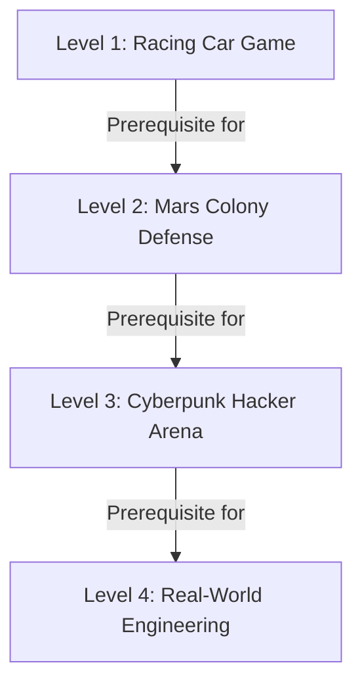

# Cyber Detective Hub - Project Definition & Educational Framework

This document outlines the core architecture, educational philosophy, and curriculum guidelines for the **Cyber Detective Hub** learning application. It serves as a source of truth for the project's evolution.

---

## 1. Educational Philosophy (AI-Era Shift)

In the era of Generative AI, memorizing programming language syntax is no longer the primary bottleneck for software engineers. Instead, the curriculum focuses on:
* **Computational Logic & Critical Thinking**: The ability to structure instructions literally, identify edge cases, and design robust algorithms.
* **System Design**: Understanding how components interact (clients, servers, databases, cloud nodes).
* **Technology Selection**: Learning how to choose and configure the right tools (databases, validation schemas, APIs, hosting pipelines).
* **Security & Defense**: Auditing system designs for security leaks, role-based privileges, and input validation gaps.

---

## 2. Level Progression & Targets

The curriculum is structured step-by-step so that student knowledge climbs sequentially from absolute foundations to real-world deployment readiness.



### Level 1: Racing Car Game (Beginner)
* **Theme**: **2D Highway Avoidance Racing Game** (HTML/CSS/JS + AI).
* **Focus**:
  * *Early Sessions:* HTML structure, CSS styling for the game track, JavaScript variables, keyboard event listeners, basic movement logic, and boundary conditionals.
  * *Late Sessions:* Obstacle generation with loops, game loop patterns (`setInterval`/`requestAnimationFrame`), collision detection math, and UI score overlays.
* **Target**: Learn core programming constructs (variables, inputs, conditionals, loops, functions) by building a fully functional web-based arcade game with AI supervision. Pacing is deliberate — students master DOM fundamentals before advancing to game logic.

### Level 2: Mars Colony Defense (Intermediate)
* **Theme**: **Colony Defense / Space Shooter Game** (Space Invaders / Grid Shooter).
* **Focus**:
  * *Bridge Topic (first):* Asynchronous programming with `fetch()` — loading leaderboard or telemetry data from a REST API using familiar DOM code to bridge from Level 1 before switching paradigms.
  * *Core Topics:* Dynamic arrays of objects (lasers/aliens), HTML5 Canvas rendering API, timer events, keyboard input matrices, and full async/await REST API integration for leaderboard persistence.
* **Target**: Learn complex data structures, the async programming model, and API integration. The deliberate `fetch()` bridge ensures students are comfortable with async thinking before encountering the Canvas API as a second new paradigm.

### Level 3: Cyberpunk Hacker Arena (Advanced)
* **Theme**: **Cyberpunk persistent hacking terminal / card battler** (Backend & DB integrations).
* **Focus**: Relational database schema design (MySQL — consistent with the platform stack), user authentication (session tokens via `Authorization: Bearer` headers), backend REST API endpoints using Node.js/Express, parameterized queries to prevent SQL injection, and role-based data isolation per user.
  * *Note:* Supabase/PostgreSQL may be referenced as an alternative cloud DB option for awareness, but MySQL + Express is the primary teaching stack, matching the Cyber Detective Hub platform itself.
* **Target**: Understand full-stack architecture, relational databases, secure API routes, and user data isolation. Students build and connect a real backend for the first time, replacing hardcoded frontend data with persistent server-side storage.

### Level 4: The Software Engineer (Capstone)
* **Theme**: None — Level 4 deliberately drops the game skin used in Levels 1-3 and frames sessions as professional software engineering practice directly (testing, real-time systems, DevOps), matching `Computer_Tutor_AIEra_Curriculum_Overview.md` §4 and `L4-Computer_Tutor_AIEra_Curriculum.md`.
* **Focus** (split into two phases to manage scope):
  * *Phase A — Real-Time Engineering:* WebSockets for live bidirectional data streams, client-side state synchronization across multiple users, performance optimization (debouncing, throttling, lazy loading), and feature flags. Directly extends Level 3's API knowledge into real-time territory.
  * *Phase B — Production Engineering:* Automated testing (unit tests, TDD mindset, integration tests), CI/CD pipeline setup (automated build and deploy on push), production monitoring and alerting, and a live "chaos defense" challenge where students must diagnose and fix failures under time pressure.
* **Target**: Apply professional engineering and DevOps practices to deploy a real-time collaborative system and defend it under live chaos testing. Phase A ensures a confident foundation in real-time concepts before Phase B introduces the full production engineering discipline.

---

## 3. Thematic Consistency Rules

* **Single Theme per Level**: To keep students immersed and focused, all sessions within the same level must share the exact same thematic setting (e.g. all Level 1 challenges operate on the Racing Car Game story, while Level 2 is space colony defense).
* **Age-Appropriate Narrative**: Themes must feel adventurous, gamified, and exciting for teenagers (avoiding domestic, baby-ish concepts like baking cakes or washing dishes).
* **Interactive Sandbox Simulations**: Level 1 exercises inside the Sandbox tab must feature interactive, visual, code-involved simulators corresponding directly to that level's theme.

---

## 4. User Profiles & Authentication
* **Authentication Method**: Token-based authentication using HTTP `Authorization: Bearer <token>` headers (where the token is currently the unique identifier of the user's profile).
* **Database Schema Modifications**:
  * `user_profile`:
    * Added `username` VARCHAR(50) UNIQUE (e.g. control number or identifier)
    * Added `password` VARCHAR(100) (security access key)
    * Added `role` VARCHAR(20) DEFAULT 'student' (values: `'student'` or `'teacher'`)
* **Role-Based Control**:
  * **Teacher**: Authorized to access the Admin Panel, select campaign themes globally, register new students, and view student progress. Default account seeded: `somboon` / `somboon123`.
  * **Student**: Restricted from the Admin Panel. Progress and journal records are isolated under their own authenticated user ID. Default demo account seeded: `student_demo` / `student123`.

---

## 5. AI-Era Learning Methodology (5-Step Framework)

This framework defines the **pedagogical loop** used in every session of the Cyber Detective Hub. It replaces the traditional "watch and memorize syntax" approach with a **think, collaborate, verify, and iterate** cycle that mirrors how professional engineers work with AI tools today.

---

### Step 1 — Plan & Design the System
> **"Think before you type."**

**What students do:**
- Sketch out the problem: What inputs are needed? What should the output look like?
- Break the task into logical components (e.g., "I need a function that checks a collision, one that updates the score, and one that resets the game").
- Identify the data: What variables, arrays, or objects are needed?
- Optionally draw a simple flow diagram or pseudocode.

**Skills built:**
- Computational Logic & Algorithmic Thinking
- System Design (component decomposition)
- Requirement Clarity (defining success before building)

**Why it matters in the AI era:**
AI cannot design a system for you if *you* don't understand the problem. The quality of the plan directly determines the quality of the AI output. Weak plans produce generic, broken code.

---

### Step 2 — Write the AI Prompt
> **"Precision in language produces precision in code."**

**What students do:**
- Translate their plan from Step 1 into a clear, structured AI prompt.
- Specify: the programming language, the context (e.g., "inside an HTML5 canvas game"), the exact behavior expected, any constraints or edge cases identified in Step 1.
- Use the **Sandbox** tab in the app to write and submit their prompt.

**Skills built:**
- Prompt Engineering (the core skill of AI-era developers)
- Communication Precision (turning vague ideas into exact specifications)
- Technology Selection (deciding which tools/approaches to request)

**Why it matters in the AI era:**
Prompt writing is the new programming. A student who can write a great prompt can command any AI model, any language, and any framework — making their skills transferable beyond any single technology.

---

### Step 3 — Review & Explain the Output
> **"You own the code, even if AI wrote it."**

**What students do:**
- Read through every line of the AI-generated code.
- Explain in their own words what each function or block does.
- Identify any unfamiliar syntax or patterns and look them up.
- Accept, reject, or flag sections that seem incorrect or incomplete.

**Skills built:**
- Code Literacy (reading and understanding code without writing it from scratch)
- Critical Evaluation (distinguishing good AI output from plausible-looking bad output)
- Debugging Awareness (spotting logical issues before running the code)

**Why it matters in the AI era:**
AI output is not automatically correct. A developer who cannot read and evaluate code is at the mercy of the AI's mistakes. This step ensures students remain the **human-in-the-loop**, not passive consumers.

---

### Step 4 — Test & Break It
> **"If you haven't tried to break it, you haven't tested it."**

**What students do:**
- Run the code and verify the happy-path works as expected.
- Deliberately try to cause failures: input invalid data, trigger boundary conditions, perform unexpected actions (e.g., press multiple keys simultaneously in the racing game).
- Note what breaks and why.
- Ask: "What did the AI miss that I need to fix?"

**Skills built:**
- Debugging Mindset (systematic identification of failure modes)
- Edge-Case Thinking (anticipating the unexpected)
- Security Awareness (input validation, boundary checking)

**Why it matters in the AI era:**
This is the most critical differentiator between a passive AI user and a competent AI-era engineer. AI models optimize for the typical case; engineers must defend against the *atypical* case. Students who regularly break their own code develop a natural instinct for robustness.

---

### Step 5 — Iterate & Improve
> **"The first prompt is a draft, not a final answer."**

**What students do:**
- Based on the findings from Steps 3 and 4, refine their original prompt (or write a follow-up prompt) to fix the issues discovered.
- Re-submit to the AI, compare the new output to the previous version, and identify what improved and what regressed.
- Repeat the cycle (Steps 2–5) until the solution meets the design goals from Step 1.
- Save each revision in the **Journal** tab (tracked as `journal_versions` in the database).

**Skills built:**
- Iterative Engineering Judgment (knowing when to refine vs. restart)
- Multi-Prompt Workflow (managing a productive back-and-forth with an AI model)
- Reflective Learning (understanding *why* the revised prompt produced a better result)

**Why it matters in the AI era:**
Professional AI-era programming is a **conversation**, not a single command. The ability to iteratively refine AI output — guided by clear requirements and test results — is the workflow used by senior engineers at the world's leading technology companies. This step directly mirrors that real-world practice.

---

### Summary Table

| Step | Name | Core Question | Primary Skill |
|------|------|---------------|---------------|
| 1 | **Plan & Design** | *What do I need to build?* | Computational Logic, System Design |
| 2 | **Write the AI Prompt** | *How do I describe it precisely?* | Prompt Engineering, Communication |
| 3 | **Review & Explain** | *Do I understand what AI gave me?* | Code Literacy, Critical Evaluation |
| 4 | **Test & Break It** | *Where does it fail?* | Debugging, Edge-Case Thinking |
| 5 | **Iterate & Improve** | *How do I make it better?* | Iterative Engineering, Refinement |

---

## 6. Game Project Delivery Model (Decision: Option B — Hybrid)

**Decision date:** 2026-07-06

The Level Game Projects (e.g., Level 1 Racing Car Game, Level 2 Mars Colony Defense) follow a **Hybrid delivery model**. The platform acts as the **engineering methodology scaffold**; external AI coding tools (e.g., Cursor, ChatGPT) perform the actual code generation.

### Rationale
- Keeps the platform focused on methodology and learning tracking — not on competing with purpose-built AI coding IDEs.
- Exposes students to the real-world professional workflow: use specialized tools for code generation, use structured process management for thinking and review.
- Eliminates the need for a costly AI API integration in the platform (reserved as a potential v2 upgrade).
- Every step of the 5-Step Framework maps cleanly to a platform feature (see below).

### How the Hybrid Model Works per Step

| Step | Student Action | Platform Role | External Tool Role |
|------|---------------|---------------|--------------------|
| **1. Plan & Design** | Fill in a structured design form (components, data, flow diagram) | Hosts and saves the plan template | — |
| **2. Write the AI Prompt** | Draft the prompt in the platform's Prompt Editor | Saves the prompt to `journal_versions` | Student copies prompt → runs in Cursor / ChatGPT |
| **3. Review & Explain** | Paste the AI-generated code back; annotate each section | Hosts the code display + annotation/explanation UI | Generated code comes from external AI |
| **4. Test & Break It** | Write test cases and log what fails | Hosts the test case checklist UI | Student runs the game file locally in the browser |
| **5. Iterate & Improve** | Refine the prompt, re-submit externally, paste new version back | Tracks each revision in `journal_versions` | Next iteration runs in Cursor / ChatGPT |

### Where Game Files Live
- The actual game source files (`.html`, `.js`, `.css`) live **locally on the student's computer**.
- Students may optionally paste or upload the final working file to the platform for teacher review and completion tracking.
- The platform does **not** execute or render the game code internally in v1.

### Two Distinct AI Roles (Critical Design Principle)

This platform deliberately separates two different AI roles. Confusing them leads to poor product design decisions.

| Role | AI Type | Examples | Responsibility |
|------|---------|----------|----------------|
| **AI IDE (Code Generator)** | Industrial AI coding tools | Cursor, GitHub Copilot, Antigravity, Claude CLI | Generate code from student prompts. Students MUST learn these tools as a core professional skill. |
| **Platform AI (Teacher Assistant)** | Embedded LLM within the platform | OpenAI / Gemini API via the platform | Explain code, ask Socratic guiding questions, answer "why" questions, support comprehension — never generate production code for the student. |
| **Platform AI (Auditor)** | Embedded LLM with full curriculum context | Same API, separate system prompt | Audit student exercise answers, project task submissions, and design plans. Cross-check AI-generated code against the student's own design plan, session objectives, and project tech stack constraints. |

**Why this separation matters:**
- Industrial AI tools are what students will use throughout their careers. Exposure to them is **not optional** — it is part of the curriculum.
- The platform's TA role supplements the teacher, not the AI IDE. A TA helps a student *understand* what the AI IDE produced; it does not do the producing.
- The platform's **Auditor role** has a critical advantage over external AI tools: it holds full context of the curriculum, the session's learning objectives, the student's own Step 1 design plan, and the project's tech stack. Cursor or ChatGPT has none of this. This makes the platform TA a more reliable cross-checker of AI-generated code than any external tool.
- This keeps the platform laser-focused on *learning* rather than becoming a redundant, inferior version of Cursor or Copilot.

### Future Upgrade Path (v2)
- **Platform AI — Teacher Assistant features:**
  - Code explanation on demand (student selects code block, asks "explain this").
  - Personalized Socratic guide questions generated from the student's specific pasted code.
  - Free-form comprehension Q&A: student asks "why" questions, platform TA answers in teaching style.
- **Platform AI — Auditor features:**
  - *Student Work Audit:* Evaluate exercise answers and project task submissions against session learning objectives and expected outcomes; provide structured, rubric-style feedback.
  - *AI-Generated Code Audit:* After student pastes code from Cursor/ChatGPT (Step 3), the Auditor cross-checks it against: (1) the student's own design plan from Step 1, (2) the session's curriculum scope, (3) the project's defined tech stack, and (4) common security and quality issues. Returns a structured report: what is correct, what deviates, what the student should question.
  - *Design Plan Audit:* At the end of Step 1, review the student's plan for logical gaps, missing components, or misunderstandings before they proceed to prompting AI.
- **Inline AI Prompt Execution (code generation, separate from TA):** Add an optional in-platform route so Step 2 can be run via API without switching to an external tool — keeping the TA and code-gen roles clearly separated in the UI.
- **Sandboxed Game Preview:** iframe code preview panel for teacher and student review inside the platform.

---

## 7. Code Review Strategy — Level-Appropriate Escalation

### The Problem
In the Hybrid model (Option B), students generate code in Cursor/ChatGPT and bring it to the platform for review. As projects grow across multiple files with partial-line changes, manual copy-paste becomes impractical and error-prone.

### Solution: Level-Gated Review Mechanism
The review mechanism escalates in sophistication alongside the student's level — and each escalation is itself a new professional skill being taught.

| Level | Project Size | Review Mechanism | New Skill Taught |
|-------|-------------|------------------|-----------------|
| **L1** | Single HTML file | Copy-paste to platform | Reading every line of AI output deliberately |
| **L2** | Multi-file canvas game | Platform runs `git pull` + `git diff` from student's GitHub repo | Git commit workflow, diff-based code review |
| **L3** | Full-stack app | Platform reads GitHub PR diff | Pull Request workflow, structured change review |
| **L4** | Production system | CI/CD pipeline triggers platform audit on push | Automated code review integration |

### Level 1 — Copy-Paste (Intentional)
At Level 1, the entire project is one single `.html` file. Copy-paste is not a workaround — it is pedagogically correct. The friction of pasting every line forces the student to confront and read the code. This is the intended behavior for beginners who must not skip the reading step.

### Level 2+ — Git Integration (Platform-Executed)
When projects span multiple files, the platform takes over the code retrieval responsibility using server-side Git commands. The student never needs to manually copy code again.

**Workflow:**
1. Student finishes an AI coding session in Cursor and runs `git commit -m "session 3 - added collision logic"`.
2. Student clicks **"Sync Latest Code"** in the platform.
3. The platform backend executes:
   ```bash
   git pull origin main
   git diff <previous-session-commit>..<latest-commit>
   ```
4. The diff output is parsed and rendered in the platform as a **colour-coded diff view** — green for additions, red for deletions — showing only the lines the AI changed, across all affected files.
5. The student annotates and reviews only the diff. The TA Auditor receives the same diff to cross-check against the student's design plan and session scope.

**Why this approach is superior to full-file copy:**
- Shows *only what changed* — matching how professional Pull Request reviews work in industry.
- Eliminates the problem of large projects being too big to review in full.
- The platform's server-side Git execution means no additional tooling is needed on the student's machine beyond a standard Git installation.
- Commit history becomes the natural Iteration Log (Step 5), with each AI session represented as a reviewable snapshot.

### Git Skill Progression as Curriculum
Teaching Git is not overhead — it is an explicit learning milestone embedded naturally into the review workflow:

| Level | Git Skills Introduced |
|-------|-----------------------|
| **L2** | `git init`, `git add`, `git commit` — local commits after each AI session |
| **L3** | `git push`, GitHub repo linking, branch management — connecting to remote and platform |
| **L4** | Pull Requests, CI/CD hooks — professional team workflow and automated deployment triggers |

---

## 8. Student Machine Setup Guide

This section defines the software and accounts that must be pre-installed or created on each student machine before the first session of each level. Setup is cumulative — each level inherits all requirements from the previous level.

---

### Level 1 — Beginner Setup

**Goal:** Minimal. Students need only a browser and an AI coding IDE. No servers or build tools.

#### 🖥️ Software to Install

| Software | Version | Installation Link | Notes |
|----------|---------|-------------------|-------|
| **Google Chrome** | Latest | https://www.google.com/chrome | Primary browser for running the game and accessing the platform |
| **Cursor** | Latest | https://www.cursor.com | AI coding IDE — free tier is sufficient for L1 |

#### 🔑 Accounts to Create

| Account | URL | Notes |
|---------|-----|-------|
| **GitHub** | https://github.com | Required to activate Cursor; establishes professional identity from day one |
| **Computer Tutor Platform** | *(platform URL)* | Teacher registers the student account; student receives login credentials |

#### ✅ Teacher Pre-Session Checklist (L1)
- [ ] Chrome installed and set as default browser.
- [ ] Cursor installed and signed in with the student's GitHub account.
- [ ] Student GitHub account created and verified.
- [ ] Student account registered on the Computer Tutor platform.
- [ ] Test: student can open the platform in Chrome and log in.
- [ ] Test: student can open Cursor and create a new file.

---

### Level 2 — Intermediate Setup

**Adds:** Git CLI and Node.js. Introduces version control and local dev servers.

#### 🖥️ Software to Install (in addition to L1)

| Software | Version | Installation Link | Notes |
|----------|---------|-------------------|-------|
| **Git** | Latest LTS | https://git-scm.com/downloads | CLI version. Windows users: install Git Bash included. |
| **Node.js** | LTS (v20+) | https://nodejs.org | Required to run a local dev server (`npx serve` or `npx live-server`) for the canvas game. npm is included. |

#### 🔑 Accounts to Create (in addition to L1)

| Account | URL | Notes |
|---------|-----|-------|
| **GitHub (repo)** | https://github.com | Student creates a dedicated repository for their Level 2 game project. Teacher links this repo to the platform. |

#### ⚙️ Post-Install Configuration (L2)
```bash
# Verify Git is installed
git --version

# Set global Git identity (run once per machine)
git config --global user.name "Student Name"
git config --global user.email "student@email.com"

# Verify Node.js and npm
node --version
npm --version
```

#### ✅ Teacher Pre-Session Checklist (L2)
- [ ] All L1 items completed.
- [ ] Git installed and `git --version` returns a version number.
- [ ] Git global identity configured (`user.name` and `user.email`).
- [ ] Node.js installed and `node --version` returns v20+.
- [ ] Student GitHub repo created for the L2 project.
- [ ] Platform linked to the student's GitHub repo (via OAuth or Personal Access Token).
- [ ] Test: student runs `git init` and `git commit` successfully in a test folder.
- [ ] Test: student runs `npx serve .` and sees a local server start in the terminal.

---

### Level 3 — Advanced Setup

**Adds:** Local database server (MySQL). Introduces full-stack development with a backend and persistent data.

#### 🖥️ Software to Install (in addition to L2)

| Software | Version | Installation Link | Notes |
|----------|---------|-------------------|-------|
| **Servbay** | Latest | https://www.servbay.dev | Recommended: all-in-one local server manager (MySQL, PHP, web server) with a clean UI. Suitable for students on Windows and macOS. |
| *(Alternative)* **XAMPP** | Latest | https://www.apachefriends.org | Alternative to Servbay. More widely documented but older interface. |

> **Recommendation:** Use **Servbay** as the primary choice for a cleaner student experience. XAMPP is the fallback for machines where Servbay has compatibility issues.

#### 🔑 Accounts to Create (in addition to L2)

| Account | URL | Notes |
|---------|-----|-------|
| **Supabase** *(optional, awareness only)* | https://supabase.com | Free-tier cloud PostgreSQL. Introduced as an alternative to local MySQL for awareness, not as the primary teaching stack. |

#### ⚙️ Post-Install Configuration (L3)
```bash
# Verify MySQL is running via Servbay GUI
# Then test connection from terminal:
mysql -u root -p

# Inside MySQL — create the project database:
CREATE DATABASE IF NOT EXISTS vite_db;
```

#### ✅ Teacher Pre-Session Checklist (L3)
- [ ] All L2 items completed.
- [ ] Servbay installed and MySQL service started.
- [ ] Student can connect to MySQL from the terminal.
- [ ] Project database (`vite_db`) created and SQL schema applied (`vite_db.sql`).
- [ ] Student's L3 GitHub repo created and linked to the platform.
- [ ] Test: student runs the Express backend (`node server.cjs`) and it connects to MySQL without error.

---

### Level 4 — Capstone Setup

**Adds:** Docker (optional) and CI/CD tooling. Introduces production engineering practices.

#### 🖥️ Software to Install (in addition to L3)

| Software | Version | Installation Link | Notes |
|----------|---------|-------------------|-------|
| **Docker Desktop** | Latest | https://www.docker.com/products/docker-desktop | For containerised deployment exercises. Optional — only required for Phase B (Production Engineering). |

#### 🔑 Accounts to Create (in addition to L3)

| Account | URL | Notes |
|---------|-----|-------|
| **Vercel** | https://vercel.com | Free-tier deployment platform. Used for CI/CD pipeline exercises (auto-deploy on `git push`). Sign in with GitHub. |
| **GitHub Actions** | *(included in GitHub)* | CI/CD pipeline configuration via `.github/workflows/`. No separate account — uses existing GitHub account. |

#### ✅ Teacher Pre-Session Checklist (L4)
- [ ] All L3 items completed.
- [ ] Docker Desktop installed and running (verify with `docker --version`).
- [ ] Student Vercel account created and linked to their GitHub.
- [ ] Student's L4 project repo connected to Vercel for auto-deploy.
- [ ] Test: push a commit to GitHub and verify Vercel deploys automatically.

---

### Cumulative Setup Summary

| Requirement | L1 | L2 | L3 | L4 |
|-------------|:--:|:--:|:--:|:--:|
| Google Chrome | ✅ | ✅ | ✅ | ✅ |
| Cursor (AI IDE) | ✅ | ✅ | ✅ | ✅ |
| GitHub account | ✅ | ✅ | ✅ | ✅ |
| Computer Tutor platform account | ✅ | ✅ | ✅ | ✅ |
| Git CLI | — | ✅ | ✅ | ✅ |
| Node.js (LTS) | — | ✅ | ✅ | ✅ |
| GitHub project repo (linked to platform) | — | ✅ | ✅ | ✅ |
| Servbay / XAMPP (local MySQL) | — | — | ✅ | ✅ |
| Docker Desktop | — | — | — | ✅ |
| Vercel account | — | — | — | ✅ |
