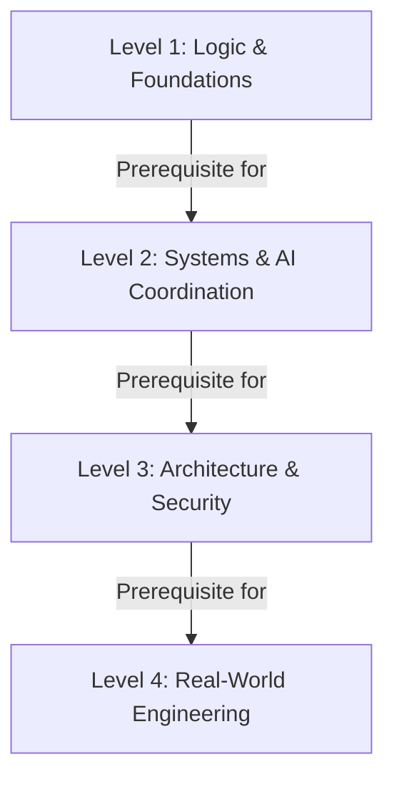

# Cyber Detective Hub - Project Definition & Educational Framework

This document outlines the core architecture, educational philosophy, and curriculum guidelines for the **Cyber Detective Hub** learning application. It serves as a source of truth for the project's evolution.

---

## 1. Educational Philosophy (AI-Era Shift)

In the era of Generative AI, memorizing programming language syntax is no longer the primary bottleneck for software engineers. Instead, the curriculum focuses on:
* **Computational Logic & Critical Thinking**: The ability to structure instructions literally, identify edge cases, and design robust algorithms.
* **System Design**: Understanding how components interact (clients, servers, databases, cloud nodes).
* **Technology Selection**: Learning how to choose and configure the right tools (databases, validation schemas, APIs, hosting pipelines).
* **Security & Defense**: Auditing system designs for security leaks, role-based privileges, and input validation gaps.

---

## 2. Level Progression & Targets

The curriculum is structured step-by-step so that student knowledge climbs sequentially from absolute foundations to real-world deployment readiness.

### Level 1: Foundations of Logic (Beginner)
* **Theme**: **Security-Drone Mission** (Remote infiltration drone navigation).
* **Focus**: Logic blocks, sequence order, data classification, and state machines.
* **Target**: Build critical thinking and literal execution skills without code syntax barrier.

### Level 2: Systems & AI Coordination (Intermediate)
* **Theme**: **Space Explorer Telemetry** (Mars rover and habitat systems).
* **Focus**: Feedback loops, constraints, AI prompt refinement, and handling data ranges.
* **Target**: Learn to leverage AI assistants safely and define constraints for automated systems.

### Level 3: Full-Stack Architecture (Advanced)
* **Theme**: **Cyberpunk Hack-Rig** (Corporate network intrusion and security auditing).
* **Focus**: Database schemas, API endpoints, user authentication, and Row-Level Security (RLS) policies.
* **Target**: Understand databases and APIs, planning data structures and access privileges before deployment.

### Level 4: Real-World Engineering (Capstone)
* **Theme**: **Production Launch & System Defense** (Deploying real codebases to the cloud).
* **Focus**: Git version control, CI/CD pipelines, production error monitoring, and ADA accessibility audits.
* **Target**: Deploy a fully functional project on live servers and defend its architectural integrity.

---

## 3. Thematic Consistency Rules

* **Single Theme per Level**: To keep students immersed and focused, all sessions within the same level must share the exact same thematic setting (e.g. all Level 1 challenges operate on the Drone Infiltration story, while Level 2 is space-themed).
* **Age-Appropriate Narrative**: Themes must feel adventurous, gamified, and exciting for teenagers (avoiding domestic, baby-ish concepts like baking cakes or washing dishes).
* **Interactive Sandbox Simulations**: Level 1 exercises inside the Sandbox tab must feature interactive, visual, code-free simulators corresponding directly to that level's theme.
