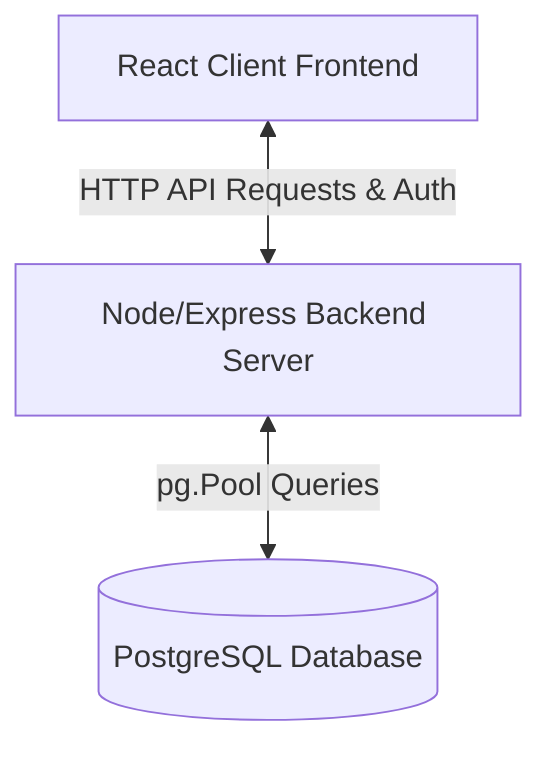

# 🕵️‍♂️ Cyber Detective Hub - Exhaustive User & Instructor Manual

Welcome to the **Cyber Detective Hub**! This application is a gamified digital training environment designed for students aged 13–16 to learn computer science, computational logic, AI prompting, and software engineering.

This document serves as the complete, definitive user manual. Whether you are a **student** logging in to solve quests, or a **teacher/admin** managing student profiles and visual themes, this manual details every screen element, system rule, database schema, and operational workflow.

---

## 📂 Table of Contents
1. **Chapter 1: Welcome & Pedagogical Philosophy**
2. **Chapter 2: System Architecture & Database Schema**
3. **Chapter 3: The Left Sidebar Navigation**
4. **Chapter 4: The Dashboard (Command Center)**
5. **Chapter 5: The Quest Files (Cases Board)**
6. **Chapter 6: The Interactive Prompt Sandbox**
7. **Chapter 7: The Prompt Journal & Homework System**
8. **Chapter 8: The Curriculum Guide & Syllabus Catalog**
9. **Chapter 9: The Global Leaderboard**
10. **Chapter 10: The Teacher Admin Console & Campaign Reskinning**
11. **Chapter 11: Troubleshooting, FAQ, & Tutoring Best Practices**

---

## 🏛️ Chapter 1: Welcome & Pedagogical Philosophy

The **Cyber Detective Hub** bridges the gap between drag-and-drop block coding and real-world scripting. Designed specifically for teenagers (ages 13–16), the application frames computer science concepts inside an engaging roleplay narrative: the student is a **Detective** solving logical system errors and security vulnerabilities.

### The Pedagogical Approach
1. **Socratic Scaffolding**: Rather than giving students raw answers, the hub encourages teachers to prompt students with guided questions.
2. **Read Before You Write**: Level 1 focuses on reading, dry-running, and analyzing logical structures before students are expected to write complex lines of code.
3. **Progressive Complexity**:
   - **Level 1 (Logic)**: Teaches sequential processes, variable types, loops, and conditions side-by-side with visual flowcharts.
   - **Level 2 (AI Copilot)**: Explores prompting as a specification language, instructing AI compilers, and requirement injection.
   - **Level 3 (Architect)**: Investigates database modeling, client-server connections, and data validation rules.
   - **Level 4 (Engineer)**: Teaches remote cloud integration, API endpoints, environment variables, and safe defaults.

---

## ⚙️ Chapter 2: System Architecture & Database Schema

The Cyber Detective Hub is a full-stack web application built on standard modern web technologies.



### 1. The Tech Stack
* **Frontend**: React.js, Vite (compiler), and Vanilla CSS (flexible, reactive styling).
* **Backend**: Node.js Express server (`server.cjs`).
* **Database**: PostgreSQL server managing user credentials, quest states, points, and journal logs.

### 2. Database Tables
The database maintains the state of your academy. The exact columns and constraints are:

#### Table `user_profile`
Maintains user data, security credentials, scores, and access levels.
* `id` (VARCHAR(50), Primary Key): Unique identifier (e.g. `std_1720000000`).
* `username` (VARCHAR(50), Unique): Access login name (e.g. `somchai_s`).
* `password` (VARCHAR(100)): Secret security key.
* `role` (VARCHAR(20), Default `'student'`): Determines system access level (`student` or `teacher`).
* `name` (VARCHAR(100)): Display name shown on dashboards and leaderboards.
* `points` (INT, Default `0`): Total XP accumulated.
* `student_level` (VARCHAR(10), Default `'L1'`): Assigned curriculum level (`L1`, `L2`, `L3`, `L4`).
* `created_at` (TIMESTAMP): Profile registration timestamp.

#### Table `completed_quests`
Logs every quest a student has solved.
* `user_id` (VARCHAR(50)): Maps to `user_profile.id`.
* `quest_id` (VARCHAR(50)): Identifier of the completed session (e.g. `l1-s1`).
* `completed_at` (TIMESTAMP): Completion timestamp.

#### Table `journal_entries`
Stores notebooks created by students.
* `id` (VARCHAR(50), Primary Key): Unique entry identifier.
* `user_id` (VARCHAR(50)): Maps to `user_profile.id`.
* `title` (VARCHAR(200)): Case title.
* `date` (VARCHAR(20)): Creation date string.
* `version` (INT): Active version counter.
* `active_version` (INT): Current selected version.

---

## 🧭 Chapter 3: The Left Sidebar Navigation

The Left Sidebar is your global remote control. It is anchored to the left of the viewport at all times.

### Sidebar Components:
1. **Logo Section (Top)**: Displays the **DETECTIVE HUB** logo alongside a security shield icon.
2. **Dashboard Button**: Loads the global statistics and feed summary.
3. **Quest Files Button**: Opens the case selector board.
4. **Curriculum Guide Button**: Opens the interactive syllabus catalog.
5. **Prompt Sandbox Button**: Loads the active coding compiler panel.
6. **Prompt Journal Button**: Opens the student notebooks and homework.
7. **Leaderboard Button**: Displays the global standings table.
8. **Admin Panel Button** *(Teacher Access Only)*: Renders at the bottom of the navigation list only if the logged-in user possesses the `'teacher'` role, separated by a thin horizontal border.
9. **Log Out Button (Red, Bottom)**: Clears local tokens, signs out the active user, and returns to the login screen.

---

## 📊 Chapter 4: The Dashboard (Command Center)

The Dashboard is the landing screen loaded upon logging in. It aggregates personal progress metrics into a clean visual overview.

```
+-----------------------------------------------------------------------+
|  [Badge: Rank]    [XP Score]    [Quests Solved]    [Journal Notebooks] |
+-------------------------------+---------------------------------------+
|                               |                                       |
|  RANK PROGRESSION DETAIL      |   RECENT ACHIEVEMENTS FEED            |
|  - Current Rank Status        |   - 20:15 Solved Case: Chef Grid      |
|  - Next Rank Progress Bar     |   - 19:42 Saved Notebook Entry        |
|                               |                                       |
+-------------------------------+---------------------------------------+
```

### Visual Layout & Details:
* **Point Cards Row (Top)**:
  - *Detective Rank Badge*: Shows your current tier logo. Ranks adjust dynamically based on your XP score.
  - *Experience Points (XP)*: Displays your exact score in bright neon green text (e.g. `450 XP`).
  - *Quests Solved Box*: Displays the number of database quest completions with a percentage progress indicator.
  - *Saved Journals Box*: Lists the total number of entries written in your notebook.
* **Rank Progression Panel (Left Column)**:
  - Displays a visual progress bar outlining how many points are needed to unlock the next rank.
  - Unlocked status messages tell the user what tools they have gained access to (e.g., "Loop Iterators Unlocked").
* **Recent Achievements Feed (Right Column)**:
  - A chronological feed pulling events from database logs.
  - Shows timestamps (e.g. `20:15`) alongside descriptive event tags (e.g., `"Evidence submitted: Grid Variable Classification (+100 XP)"`).

---

## 📁 Chapter 5: The Quest Files (Cases Board)

The Quest Files view serves as the interactive campaign selection map where you can review your available missions.

### Screen Layout:
1. **Level Selector Tabs (Top Row)**:
   - Row of four button selectors: `Level 1: Logic`, `Level 2: AI Copilot`, `Level 3: Architect`, and `Level 4: Engineer`.
   - **For Students**: Non-assigned level tabs display a padlock (`🔒`) and are disabled. If a student is assigned to Level 1, they cannot click Level 2, 3, or 4 tabs.
   - **For Teachers**: All tabs remain clickable to allow instructors to audit all content.
2. **Main Campaign Quest Banner**:
   - Outlines the global target objective for the selected Level.
   - Example: *"Operation: Safe City Grid — Design the logical blueprints for the city's automated infrastructure (drones, public transport, smart vending)."*
3. **Sub-Quest Cards List (Left Column)**:
   - Vertical listing of individual cases associated with the chosen level.
   - Each card displays the session title, a brief objective summary, and a status badge:
     - `ACTIVE` (Blue badge): The quest is incomplete.
     - `COMPLETED` (Green badge): The quest has been successfully solved.
4. **Sub-Quest Detailed Brief (Right Column)**:
   - Displays information for the selected sub-quest card:
     - **Quest Title** & **XP Reward**.
     - **Objectives Checklist**: Bullet-point goals explaining what needs to be coded.
     - **Open in Sandbox Button**: A cyan-bordered button at the bottom. Clicking this loads the session template data into memory and redirects the screen automatically to the **Prompt Sandbox** tab.

---

## 💻 Chapter 6: The Interactive Prompt Sandbox

The Prompt Sandbox is the core compiler workspace where you build and test your logic.

```
+------------------------------------+----------------------------------+
| CASE SPECIFICATION & BRIEF         | CODE EDITOR WORKSPACE            |
| - Assigned Role: Robot Controller  |                                  |
| - Task: Create sandwich maker      | [Code Area]                      |
| - Inputs: bread, butter, knife     |                                  |
|                                    |                                  |
+------------------------------------+----------------------------------+
| TELEMETRY MONITOR                  | COMPILER CONTROLS                |
| - mode: "idle"                     | [Run Simulator] (Green)          |
| - status: "success"                | [Submit Case File] (Blue)        |
|                                    +----------------------------------+
| SYSTEM LOG TERMINAL                |
| > Compilation complete.            |
+------------------------------------+
```

### Detailed Screen Components:

#### Left Column (Specifications & Diagnostics)
* **Case Specification Panel**:
  - *Assigned Role*: Your roleplay title (e.g. `Water Reclamation Controller`).
  - *Task Target*: The exact task objectives.
  - *Input Parameters*: Data variables fed into the code.
  - *Edge Case Constraints*: Boundaries that must be handled safely (e.g. empty inputs).
* **Telemetry State Monitor**:
  - Live virtual register boards.
  - Shows variable names and current values (e.g., `waterLevel: 45`, `gridStatus: "Active"`).
  - When you run code, watch these registers update in real-time as your script executes!
* **System Log Terminal**:
  - Simulated terminal output window.
  - Prints warnings, compiler notifications, success flags, or error trace logs.

#### Right Column (Writing Code)
* **The Code Editor**:
  - A text editor preloaded with template scaffolding code and comments.
  - Supports standard JavaScript styling.
* **Control Actions Row**:
  - **Run Simulator Button (Green)**: Runs compilation tests on your script. It passes parameters, evaluates rules, prints logs to the terminal, and updates the Telemetry monitors.
  - **Submit Case File Button (Blue)**: This button is locked (unclickable) when you edit your code. It activates **ONLY** after you run the simulator and your code successfully passes all validation checks without crashing. Clicking it saves your success state, updates your XP score by +100, and logs the completion.

### 💡 Purpose of the Dedicated "Prompt Sandbox" Sidebar Menu
You might wonder: *If I can open the sandbox directly by clicking "Open in Sandbox" inside Quest Files, why is there a separate "Prompt Sandbox" button in the left sidebar navigation?*

* **1. Persistent Workspace Recovery (No Code Loss)**:
  - The Prompt Sandbox maintains a persistent state. If you are writing a complex block of code and need to switch tabs (e.g., to read a lesson objective in the *Curriculum Guide* or check notes in your *Prompt Journal*), your code is not lost!
  - Clicking the **Prompt Sandbox** sidebar button takes you right back to your active editor, restoring your current typed script, state variables, and terminal logs exactly where you left off.
* **2. Distraction-Free IDE Access**:
  - It functions as your active compiler. Having it in the sidebar means you have one-click access to run diagnostic checks, write prototype loops, and dry-run syntax rules without needing to navigate back through case menus.
* **3. Reviewing Live Telemetry**:
  - If you run simulation checks and get an error message, you can switch tabs to read details of the case, and click the sidebar tab to immediately return to your terminal diagnostic outputs.

---

## 📝 Chapter 7: The Prompt Journal & Homework System

The Prompt Journal serves as your digital engineering notebook. Here, students document logic breakdowns, write specifications, complete assignments, and track iterations of their code profiles.

### 1. Screen Layout:
* **Journal List (Left Sidebar)**:
  - Lists your saved case logs in a vertical deck. Clicking a card loads that notebook entry.
  - Displays session title, creation date, and version numbers.
* **Workspace Area (Right Column)**:
  - **Notebook Header**: Displays the quest name and date timestamp.
  - **Version Toggle Row**: Switch between different stored iterations of your homework (e.g. `Version 1`, `Version 2`).
  - **Structured Prompt Specification Box**: Displays the lesson instructions or prompt template.
  - **Code Output History Box (Interactive Code Editor)**:
    - This is an **interactive `<textarea>` editor**.
    - If you want to write or edit your journal entries, simply select the text area and start typing your script or text logic.
    - **Text-Wrapping Enabled**: All text boxes in the journal wrap code lines automatically. Long lines of text or code will wrap down to the next line instead of overflowing horizontally, ensuring you can read your entire submission without needing to scroll left and right.

### 2. Action Controls & Saving to Database:
* **Save Changes Button (Blue)**:
  - Overwrites the selected version inside the database. Clicking this sends a `PUT` request to `/api/journal/version` on the backend server, storing your edits in the PostgreSQL database.
* **Save as New Version Button (Green)**:
  - Creates a new version (e.g. increments from `v1` to `v2`) to save your current edits as a new draft while keeping your previous history intact. This triggers a `POST` request to `/api/journal/version` to compile a new database record.

---

## 📖 Chapter 8: The Curriculum Guideline & Syllabus Catalog

The **Curriculum Guideline** menu (labeled "Curriculum Guide" on the sidebar) acts as a digital interactive binder containing the entire academic syllabus, lesson timelines, and instructor guides.

### 1. Header Toolbar Controls (Top of the Screen)
* **Curriculum Level Selector Tabs (Left)**:
  - Button options: `Level 1: Foundations`, `Level 2: AI & Language`, `Level 3: Architecture`, and `Level 4: Engineering`.
  - **Student Restriction**: Student profiles can only select their active assigned level (others display the padlock `🔒` and are disabled to prevent students from skipping ahead). Teachers have unrestricted access to all levels.
* **Curriculum Search Input Box (Middle-Right)**:
  - An interactive search bar with placeholder *"Search topics, activities, concepts..."*.
  - **How it works**: As you type, the screen dynamically filters the session cards list in real-time, showing only the cards whose title, module name, core activities, or objectives match your text. A small clear button (`×`) appears inside the input box to reset filters quickly.
* **Perspective Mode Toggle Switch (Right)**:
  - Labeled with **Student Mode** (left) and **Teacher Mode** (right) text parameters, with a sliding round switch button in the middle.
  - **For Students**: This switch remains hidden or read-only (locked in Student Mode).
  - **For Teachers**: Teachers can toggle this switch to immediately expand the lesson cards with secret, backend-authorized tutoring data.

### 2. Session Cards Layout (Detailed Field Breakdown)
Each session appears as a premium, glass-themed card. Under **Student Mode**, the card displays:
* **Header Row**: Shows the module classification (e.g. *Module 1: Logic & Sequence*) and the session timeline identifier (e.g. *Session 1: foundations*).
* **Objectives List**: Bulleted checklists detailing exactly what the student will know and be able to do by the end of the 2 hours.
* **Warm-Up Panel**: A brief 10–15 minute introductory activity.
* **Mini-Lesson Panel**: The core concept introduction guidelines used by the tutor.
* **Core Practice Activity**: An offline or drag-and-drop sequencing task to model the logic flow.
* **Hands-On Sandbox Lab**: A description of the matching interactive programming task that needs to be compiled in the *Prompt Sandbox* tab.
* **Homework Brief**: Outlines the notebook journaling task to be submitted inside the *Prompt Journal* tab.
* **Ethics Moment**: Discusses social and security implications of code logic.
* **Classroom Adaptations**: Tips on adjusting lesson presentation based on age groups.

### 3. Teacher Mode Extensions (Instructor Guideline Overlays)
When the **Teacher Mode** toggle is switched **ON**, three additional panels expand at the bottom of every session card:
* **💡 Socratic Prompting Guidelines**:
  - Contains exact, context-specific questions to guide struggling students rather than feeding them direct code syntax.
  - Example: *"Look at the terminal. Why did the drone crash on step 3?"* or *"How can the drone know where the door is before it performs a scan?"*
* **🔍 Socratic Check Questions**:
  - Concept-checking questions to test a student's understanding before allowing them to advance.
  - Example: *"If we bypass the firewall before scanning, what does the connector receive? Why does it fail?"*
* **🔑 Teacher Solutions Key**:
  - Displays the exact, expected Javascript code block answers or logic sequence answers required to pass the Sandbox checks. This serves as a quick reference sheet for the tutor during active coding runs.

---

## 🏆 Chapter 9: The Global Leaderboard

The Leaderboard showcases the standings of all detectives registered in the training academy.

### Screen Layout & Table Columns:
1. **Rank Position**: Your numerical rank (#1, #2, #3, etc.) displayed with colored numbers.
2. **Detective Alias**: The student's display name.
3. **Status Badge**: Displays your rank title badge:
   - `Junior` (Green badge): `0 - 799 XP`
   - `Senior` (Cyan badge): `800 - 1199 XP`
   - `Master` (Purple badge): `1200+ XP`
4. **Current Operation**: Displays the active session the student is currently working on.
5. **Total XP**: Points score.
* **Highlighting**: Your profile row is highlighted in neon green with a labeled `YOU` badge to help you find your standing instantly.

---

## 👩‍🏫 Chapter 10: The Teacher Admin Console & Campaign Reskinning

The Admin Panel is a specialized management dashboard accessible only to users with the `'teacher'` role.

### 1. Active Campaign Theme Selection
Enables teachers to change the visual theme and storytelling layer of the application:
* **Cyberpunk Metropolis**: Focuses on drone routing, variable locks, and security grids.
* **Mars Rover Colony**: Focuses on airlock controllers, telemetry pipelines, and solar grids.
* **Wizarding School Castle**: Focuses on automated cauldrons, spell lock triggers, and alchemy scales.
> [!TIP]
> Changing themes dynamically re-skins the overarching Level Quest descriptions, sub-quest titles, and sandbox brief parameters.

### 2. Register New Student Profile Form
Enables teachers to enroll new student profiles:
1. **Student Name / Alias**: Enter the student's display name.
2. **Username / Student ID**: Enter their login username.
3. **Security Access Key**: Enter a password.
4. **Student Assigned Level**: Select their starting level (`Level 1` to `Level 4`).
5. Click the green **Create Student Profile** button. The student is registered in the database, and a default starting journal entry is generated.

### 3. Active Student Roster Table
A complete management table of all registered student accounts:
* **Display Columns**: *Name*, *Username*, *Assigned Level*, and *Points*.
* **Real-time Level Changes**:
  - The *Assigned Level* column contains a `<select>` dropdown menu showing the student's level (`L1` to `L4`).
  - To upgrade a student, click the select box and pick the new level. The system sends a POST request to `/api/admin/students/level` to update the database profile immediately. The next time the student logs in, their navigation tabs will update automatically.

### 4. Local Detective Statistics Overrides
Quick buttons allowing teachers to add or deduct points from their active user account for debugging and demonstration purposes:
* **Deduct 100 XP**: Subtracts 100 points.
* **Add 100 XP**: Adds 100 points.
* **Promote to Master Rank**: Sets points to 1200 instantly to test graduate view.

---

## ❓ Chapter 11: Troubleshooting, FAQ, & Tutoring Best Practices

### 1. Troubleshooting & FAQ

#### Q: I registered a student, but they get a "Username already exists" error.
A: Student usernames must be globally unique. Choose a different username (e.g. add their student ID number like `somchai_s_001`).

#### Q: A student was upgraded to Level 2, but they still see Level 1.
A: Have the student click the **Log Out** button and sign back in, or force-refresh their browser tab (**Ctrl + F5** or **Cmd + Shift + R**) to download the updated user profile from the database.

#### Q: The simulator runs successfully, but the "Submit Case File" button is disabled.
A: Ensure the script output log displays a success status check. If the terminal prints any runtime warning flags or if the telemetry variables fail constraint checks, the submit button remains deactivated.

---

### 2. Tutoring Best Practices (2-Hour Sessions)

Teachers can use this application structure to guide students through the 2-hour learning schedule:

```mermaid
gantt
    title 2-Hour Tutoring Session Breakdown
    dateFormat  m
    axisFormat %M
    Warm-up            :active, 0, 15m
    Board Lesson       : 15m, 35m
    Concept Practice   : 35m, 60m
    Sandbox Lab        : 60m, 95m
    Debugging / Audit  : 95m, 110m
    Homework & Wrap    : 110m, 120m
```

1. **00:00 - 00:15 | Socratic Warm-Up**: Review the warm-up task in the Curriculum Guide. Act out code commands literally.
2. **00:15 - 00:35 | Concept Discussion**: Present the board lesson. Discuss how loops, conditions, or data variables function.
3. **00:35 - 01:00 | Concept Practice**: Use the notebook/journal to sketch visual flowcharts.
4. **01:00 - 01:35 | Sandbox Lab**: Select the active Quest File, launch the Sandbox, and write/test the program logic.
5. **01:35 - 01:50 | Auditing logs**: Intentionally introduce logic errors (Chaos Monkey constraints) and ask the student to debug using the telemetry logs.
6. **01:50 - 02:00 | Wrap-up**: Log homework in the Journal tab and review.
